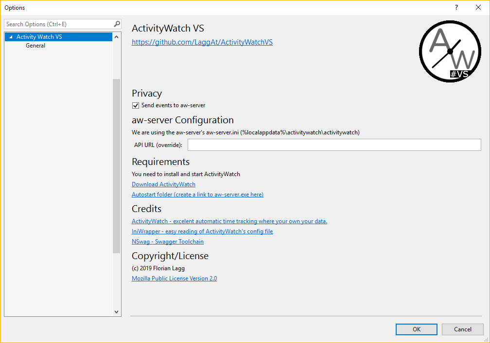

# ActivityWatchVS

<!-- Replace this badge with your own-->

<!-- Update the VS Gallery link after you upload the VSIX
Download this extension from the [VS Gallery](https://visualstudiogallery.msdn.microsoft.com/[GuidFromGallery])
or -->get the [CI build](http://vsixgallery.com/extension/ActivityWatchVS.ea6d1160-0387-4c74-9caf-1f9fcabf5ea5/).

---------------------------------------

Track your work with this plugin and activitywatch.net. Ever wanted to know where you spend your time?

The Plugin is a Watcher for Visual Studio. It enables tracking of all, you do in your solution. We send this data to an Activity Watch installation on your machine, all tracked data belongs to you.

ActivityWatch tracks windows titles, we extend this functionality from inside Visual Studio.

See the [change log](CHANGELOG.md) for changes and road map.

## Features

- Track file edits in Visual Studio
- Autostart ActivityWatch
- Configuration

### Track file edits in Visual Studio
This VS plugin tracks your edits in visual studio. When you start to work on another file or after some time we send these events to ActivityWatch, usually running on localhost:5600.

### Autostart ActivityWatch
If we cannot send events we try to start the ActivityWatch process once. We search different locations. For this to work place the binaries inside an 'ActivityWatch' folder inside %AppData% or Program Files folder.

### Configuration
Usually you don't need any configuration. We try to read the ActivityWatch config file, else use the ActivityWatch defaults. If you need to you can configure the URL to the ActivityWatch service or (temporarly) disable the event pump.

## Contribute
Check out the [contribution guidelines](CONTRIBUTING.md)
if you want to contribute to this project.

## License
[Mozilla Public License Version 2.0](LICENSE.txt)